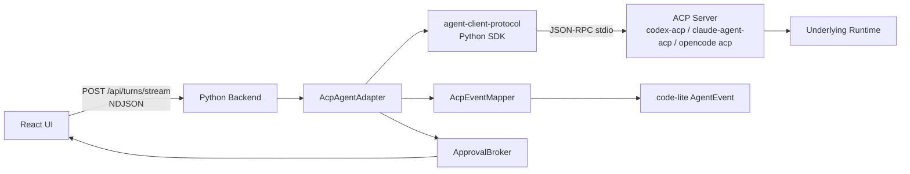

# ACP Agent Adapter 实施设计

验证日期：2026-07-03

本文是 code-lite 接入 Codex、Claude Code、opencode 的 ACP 技术路线收口文档。它汇总已有 ACP 调研、Python SDK demo、`codex-acp` 真实验证，以及当前 Python backend / React UI 的协议现状，作为后续实现 ACP adapter 的主入口。

相关背景文档：

1. `docs/ACP_ADAPTER_DESIGN.md`：ACP 协议与 runtime 安装、配置、权限问题的调研。
2. `docs/PYTHON_BACKEND_ACP_ADAPTER_DESIGN.md`：保留 Python backend 的 ACP adapter 架构。
3. `docs/UNIFIED_ACP_ADAPTER_DESIGN.md`：统一前端会话能力、模型、模式和事件格式。
4. `demo/acp-demo/python_sdk_acp_probe.py`：官方 Python SDK 与真实 `codex-acp` 探针。

## 1. 技术路线定稿

最终路线：

```text
React UI
  -> Tauri desktop shell
  -> Python backend sidecar
  -> FastAPI /api/turns/stream NDJSON
  -> AcpAgentAdapter
  -> official agent-client-protocol Python SDK
  -> ACP server process
  -> Codex / Claude Code / opencode runtime
```

核心结论：

1. 不重构当前 Python backend 到 Node。
2. 不改当前 UI 主交互协议，仍使用本地 HTTP + NDJSON。
3. 后端正式 ACP client 优先使用官方 `agent-client-protocol` Python SDK。
4. `codex-acp`、`claude-agent-acp`、`opencode acp` 仍是独立 runtime 入口，不由 Python SDK 替代。
5. 产品态通过设置页补全托管 Node 与固定版本 ACP npm 包，而不是要求用户预装 Node、Codex、Claude Code。
6. MVP 采用 compat mode：使用 runtime 原生工具链，code-lite 做会话、事件、审批桥接。
7. 产品级强权限边界后续走 gateway mode：由 code-lite 提供 `fs`、`terminal` 或 MCP 工具网关。

整体架构：



## 2. 已验证发现

### 2.1 ACP 与 runtime

ACP 是协议，不是 agent runtime。需要拆成三层：

```text
ACP protocol
  定义 JSON-RPC method、schema、stdio transport。

ACP server wrapper
  codex-acp / claude-agent-acp / opencode acp。

Underlying runtime
  Codex App Server / Claude Code runtime / opencode runtime。
```

因此 Python backend 能实现 ACP client，但不能“直接通过 ACP 调模型”。它必须启动或连接一个具体 ACP server。

### 2.2 Python SDK

官方 Python SDK 有实际用途：

| 项 | 结论 |
| --- | --- |
| PyPI 包名 | `agent-client-protocol` |
| import 名 | `acp` |
| 主要价值 | schema、stdio process、connection、router、raw observer |
| 替代内容 | 手写 JSON-RPC transport 的大部分工作 |
| 不替代内容 | `codex-acp`、`claude-agent-acp`、`opencode acp` runtime wrapper |

已用 `demo/acp-demo/python_sdk_acp_probe.py` 验证：

1. mock agent allow / reject 审批路径通过。
2. Python SDK 能 spawn `codex-acp`。
3. SDK 能把 `session/update`、`session/request_permission` 分发到 Python handler。
4. raw observer 能记录 runtime-specific `_meta`，适合调试和兼容扩展字段。

### 2.3 Codex ACP 实测

使用：

```powershell
uv run --with agent-client-protocol python .\demo\acp-demo\python_sdk_acp_probe.py --agent codex --prompt= --temp-workspace
```

结果：

1. `npx -y @agentclientprotocol/codex-acp` 可启动。
2. 当前本机 `agentInfo.version=1.1.0`。
3. `initialize` 返回能力包括 `loadSession`、`resume`、`list`、`close`、`additionalDirectories`、HTTP MCP、image、embedded context。
4. `session/new` 返回 modes、models、config options。
5. modes 包含 `read-only`、`agent`、`agent-full-access`。
6. config options 包含 `mode`、`model`、`reasoning_effort`、`fast-mode`。

真实 turn 验证：

1. 普通 turn 会发送 `usage_update`，可获得 `used` 与 `size`。
2. 本机一次验证中 context window `size=258400`。
3. `PromptResponse.usage` 与 `_meta.quota.token_count` 也有 token 数据，但 SDK schema 标记为 unstable。
4. `/status` 不一定发送 `usage_update`，不能当作稳定 context 查询 API。
5. `/compact` 会出现文本信号和新的 `usage_update`，但 ACP schema 没有标准 compaction 字段。

审批验证：

1. `INITIAL_AGENT_MODE=read-only` 下尝试创建文件会触发 `session/request_permission`。
2. options 包括 `allow_once`、`allow_always`、带 exec policy amendment 的 allow，以及 `reject_once`。
3. probe client 选择 `reject_once` 后，探针文件未创建。
4. probe client 声明 `fs.writeTextFile=false`、`terminal=false` 时，Codex 仍通过 runtime 原生工具链产生 tool event 和 permission request，没有走 code-lite `terminal/create` gateway。

这个结果确认：Codex ACP compat mode 有实际价值，但不能替代 code-lite 后续 gateway mode。

### 2.4 ACP npm 包与底层 runtime 关系

2026-07-03 通过 `npm view` 观察到：

| 包 | bin | 关键依赖 |
| --- | --- | --- |
| `@agentclientprotocol/codex-acp` | `codex-acp` | `@openai/codex`、`@agentclientprotocol/sdk` |
| `@agentclientprotocol/claude-agent-acp` | `claude-agent-acp` | `@anthropic-ai/claude-agent-sdk`、`@agentclientprotocol/sdk` |

因此产品安装 `codex-acp` / `claude-agent-acp` 时，npm 会安装对应的 runtime SDK/CLI 依赖。用户不需要另外预装这两个 ACP wrapper；是否还需要本机已有 Codex 或 Claude Code，取决于 wrapper 的配置和认证策略。

code-lite 的产品策略：

1. 默认使用 code-lite 托管 Node + 固定版本 ACP npm package。
2. 允许高级用户用 `CODEX_PATH`、自定义 command 或 system path 指向本机已安装 runtime。
3. 认证与账号配置不写入仓库，优先走 runtime 原生登录态或用户私有配置目录。
4. opencode 暂按 system command `opencode acp` 处理，后续确认可托管分发方式后再加入 managed install。

## 3. Backend 模块设计

新增目录建议：

```text
backend/code_lite_backend/agents/acp/
  __init__.py
  adapter.py
  sdk_client.py
  runtime_registry.py
  runtime_installer.py
  process.py
  mapper.py
  approvals.py
  sessions.py
  diagnostics.py
```

职责：

| 文件 | 职责 |
| --- | --- |
| `adapter.py` | 实现当前 `AgentAdapter` protocol，对 `/api/turns/stream` 输出 `AgentEvent` |
| `sdk_client.py` | 封装 `acp.spawn_agent_process()`、initialize、session/new、prompt、cancel、close |
| `runtime_registry.py` | Codex、Claude Code、opencode 的 descriptor、env、默认模式 |
| `runtime_installer.py` | 设置页运行时补全、托管 Node、npm 包安装、manifest |
| `process.py` | Windows `.cmd` 解析、stderr ring buffer、进程树清理 |
| `mapper.py` | ACP schema 到 code-lite `AgentEvent` 的映射 |
| `approvals.py` | ACP permission options 与当前 allow / deny UI 的映射 |
| `sessions.py` | `conversationId` 到 ACP `sessionId` 的绑定与恢复 |
| `diagnostics.py` | raw observer、preflight、capability snapshot、调试输出 |

### 3.1 适配当前 AgentAdapter

当前后端已经定义：

```python
class AgentAdapter(Protocol):
    name: str
    capabilities: AgentAdapterCapabilities

    async def stream_turn(self, request: AgentRunRequest) -> AsyncIterator[AgentEvent]:
        ...

    async def cancel_turn(self, turn_id: str) -> bool:
        ...
```

`AcpAgentAdapter` 继续实现该 protocol：

```text
AcpAgentAdapter.stream_turn(request)
  -> resolve runtime descriptor
  -> ensure AcpRuntimeConnection
  -> ensure native ACP session for conversation_id
  -> send prompt
  -> yield mapped AgentEvent
  -> persist latest usage / context / native session ref
```

### 3.2 SDK client handler

`CodeLiteAcpClient` 是传给 SDK 的 client handler：

```text
CodeLiteAcpClient
  session_update(session_id, update)
    -> AcpEventMapper.map_update(...)
    -> event queue

  request_permission(session_id, tool_call, options)
    -> AcpApprovalMapper.to_approval_event(...)
    -> ApprovalBroker.create(...)
    -> wait UI decision
    -> return selected ACP outcome

  read_text_file / write_text_file / create_terminal / ...
    -> MVP: reject or method disabled
    -> gateway mode: route to code-lite execution gateway
```

注意：SDK connection 不要重复启动 receive loop。mock agent server 端若手动 `listen()`，需要 `AgentSideConnection(..., listening=False)`。

### 3.3 Runtime connection

`AcpRuntimeConnection` 建议持有：

```text
runtime_id
descriptor
process
sdk_connection
initialize_result
stderr_ring_buffer
raw_event_observer
sessions: conversation_id -> native_session_id
active_turns: turn_id -> native_session_id
latest_usage: native_session_id -> usage snapshot
```

连接生命周期：

```text
spawn process
  -> initialize
  -> session/new or session/load
  -> prompt
  -> optional session/close
  -> process close on backend shutdown or runtime switch
```

MVP 可以按 workspace 复用连接，避免每 turn 都重启 runtime。

## 4. Runtime Descriptor 协议

统一 descriptor 负责描述“如何安装、如何启动、默认能力和 caveat”。

```json
{
  "id": "codex-acp",
  "label": "Codex",
  "family": "codex",
  "adapterKind": "acp",
  "distribution": {
    "kind": "managed-npm",
    "package": "@agentclientprotocol/codex-acp",
    "version": "<pinned>",
    "bin": "codex-acp"
  },
  "command": ["<runtime-dir>/node_modules/.bin/codex-acp.cmd"],
  "configMode": "user-native",
  "defaultMode": "read-only",
  "clientCapabilities": {
    "fs": {
      "readTextFile": false,
      "writeTextFile": false
    },
    "terminal": false
  },
  "capabilities": {
    "streaming": true,
    "sessions": true,
    "toolEvents": true,
    "approvalRequests": true,
    "contextUsage": "best_effort",
    "compaction": "runtime_specific",
    "nativeSkills": true,
    "gatewayMode": false
  },
  "caveats": [
    "compat mode 不能保证所有危险动作都经由 code-lite gateway",
    "usage_update 是 best effort",
    "compaction 没有 ACP 标准字段"
  ]
}
```

### 4.1 Distribution kind

| kind | 用途 |
| --- | --- |
| `managed-npm` | code-lite 托管 Node + 固定版本 npm 包 |
| `managed-binary` | code-lite 托管平台二进制 |
| `system` | 用户 PATH 中的命令 |
| `custom` | 用户显式选择的绝对路径 |
| `dev-npx` | 开发期临时验证，不作为产品默认 |

发现优先级：

1. 用户显式 custom path。
2. code-lite managed runtime。
3. system PATH。
4. dev-only `npx -y`。

不要自动从 workspace `node_modules/.bin` 发现 runtime，避免项目劫持执行入口。

## 5. 三个 ACP Runtime 适配器

### 5.1 Codex ACP

Descriptor：

```json
{
  "id": "codex-acp",
  "label": "Codex",
  "family": "codex",
  "managedPackage": "@agentclientprotocol/codex-acp",
  "defaultCommand": ["codex-acp"],
  "defaultMode": "read-only",
  "configMode": "user-native"
}
```

启动环境：

| 变量 | 策略 |
| --- | --- |
| `NO_BROWSER` | 默认 `1`，避免 backend smoke 触发浏览器登录 |
| `INITIAL_AGENT_MODE` | 默认 `read-only` |
| `APP_SERVER_LOGS` | 指向 code-lite runtime log 目录 |
| `CODEX_HOME` | isolated 模式才设置 |
| `CODEX_PATH` | 高级用户选择本机 Codex binary 时设置 |
| `CODEX_CONFIG` | 用于注入本轮受控配置，禁止写入密钥 |

已验证能力：

| 能力 | 状态 |
| --- | --- |
| initialize/session-new | 已验证 |
| modes/models/config options | 已验证 |
| text streaming | 已验证 |
| usage_update | 已验证 |
| permission request | 已验证 |
| compact command | 已验证为 runtime-specific |
| client fs/terminal gateway | 未启用；后续 gateway mode 验证 |

Skills / context：

1. Codex 原生读取 `AGENTS.md`、Codex skills、plugins、MCP、`CODEX_HOME` 配置。
2. code-lite 不直接复制 skill 到 `~/.codex`。
3. code-lite skill 通过 prompt embedded resource 或 MCP bridge 提供。
4. UI 需要显示“使用 Codex 原生上下文”或“使用 code-lite 隔离上下文”。

### 5.2 Claude Code ACP

Descriptor：

```json
{
  "id": "claude-agent-acp",
  "label": "Claude Code",
  "family": "claude_code",
  "managedPackage": "@agentclientprotocol/claude-agent-acp",
  "defaultCommand": ["claude-agent-acp"],
  "defaultMode": "ask",
  "configMode": "user-native",
  "status": "experimental"
}
```

安装策略：

1. 设置页使用托管 Node 安装固定版本 `@agentclientprotocol/claude-agent-acp`。
2. 安装后检查 Claude Agent SDK optional native binary 是否存在。
3. preflight 先只做 `initialize` 和 `session/new`。
4. 真实 prompt 需显式启用，避免误触发额度或工具调用。

待验证能力：

| 能力 | 状态 |
| --- | --- |
| initialize/session-new | 待 smoke |
| usage_update | 待 smoke |
| permission request | 待 smoke |
| `.claude/skills` / `CLAUDE.md` 加载 | 待 smoke |
| setting sources / isolated mode | 待 smoke |
| compact / context management | 待 smoke |

配置 caveat：

1. Claude Agent SDK 支持 skills、commands、settings sources，但 ACP wrapper 是否完整暴露仍需验证。
2. 如果不能可靠隔离 `~/.claude` 和项目 `.claude`，MVP 标记为 user-native experimental。
3. 权限审批仍只是 runtime 主动请求，不是产品级硬边界。

### 5.3 opencode ACP

Descriptor：

```json
{
  "id": "opencode-acp",
  "label": "opencode",
  "family": "opencode",
  "defaultCommand": ["opencode", "acp"],
  "defaultMode": "ask",
  "configMode": "code-lite-isolated",
  "status": "experimental"
}
```

安装策略：

1. 优先支持用户系统 `opencode acp`。
2. 后续支持 managed binary 或 managed package。
3. 设置页 preflight：`opencode --version`、`opencode acp` initialize。

建议环境：

| 变量 | 策略 |
| --- | --- |
| `OPENCODE_CONFIG_DIR` | isolated 模式指向 code-lite runtime state |
| `OPENCODE_CONFIG_CONTENT` | 注入本轮权限与模型配置 |
| `OPENCODE_PERMISSION` | 注入 ask/deny 策略 |
| `OPENCODE_DISABLE_CLAUDE_CODE_*` | 高风险 workspace 默认禁用不必要的 Claude 兼容读取 |

待验证能力：

| 能力 | 状态 |
| --- | --- |
| initialize/session-new | 待 smoke |
| usage_update | 待 smoke |
| permission request | 待 smoke |
| stats / compaction | 待 smoke |
| project `.opencode` 合并行为 | 待 smoke |

## 6. 运行时安装与设置页

产品态默认路径：

```text
设置页 Agent Runtime 检测
  -> 检查 code-lite 托管 Node runtime
  -> 缺失则提示安装托管 Node
  -> 使用托管 npm 安装固定版本 ACP package
  -> 执行 preflight
  -> 写 runtime manifest
  -> 后续 backend 启动固定本地命令
```

目录：

```text
%USERPROFILE%/.code-lite/runtimes/
  node/<version>/
    node.exe
    npm.cmd
    npx.cmd
  acp/
    codex-acp/<package-version>/
      package.json
      node_modules/
      node_modules/.bin/codex-acp.cmd
    claude-agent-acp/<package-version>/
      package.json
      node_modules/
      node_modules/.bin/claude-agent-acp.cmd
  manifests/
    codex-acp.json
    claude-agent-acp.json
    opencode-acp.json
```

manifest 示例：

```json
{
  "adapterId": "codex-acp",
  "source": "code-lite-managed-npm",
  "package": "@agentclientprotocol/codex-acp",
  "packageVersion": "<pinned>",
  "nodeRuntime": "code-lite-managed",
  "command": "C:/Users/.../.code-lite/runtimes/acp/codex-acp/<version>/node_modules/.bin/codex-acp.cmd",
  "verifiedAt": "2026-07-03T00:00:00Z",
  "initialize": {
    "ok": true,
    "agentInfo": {
      "name": "@agentclientprotocol/codex-acp",
      "version": "1.1.0"
    }
  }
}
```

manifest 禁止保存 API key、token、账号密码、私钥。

设置页状态：

| 检查项 | 含义 |
| --- | --- |
| Node runtime | 托管 Node 是否存在 |
| package | 固定版本 npm 包是否安装 |
| command | bin shim 是否可执行 |
| native dependency | runtime 依赖是否完整 |
| initialize | ACP 握手是否成功 |
| auth | 是否检测到可用认证或 auth methods |
| config mode | user-native / code-lite-isolated |
| caveat | 权限、skills、usage 的已知限制 |

## 7. 配置、skills 与上下文

ACP 不统一 runtime 配置和 skill 目录。code-lite 必须显式区分：

| 类型 | 归属 |
| --- | --- |
| runtime native config | Codex / Claude / opencode 自己读取 |
| code-lite config | runtime descriptor、权限模式、UI 状态、远程同步 |
| code-lite skill | 通过 prompt embedded resource 或 MCP bridge 注入 |
| runtime native skill | 仅在用户选择继承时加载 |

配置模式：

| 模式 | 含义 | 默认建议 |
| --- | --- | --- |
| `user-native` | 使用用户本机 runtime 配置 | 快速接入、个人本机使用 |
| `code-lite-isolated` | 使用 code-lite runtime state | 演示、远程协作、高风险 workspace |

SkillBridge：

```text
code-lite SkillRegistry
  -> ACP prompt embedded resource
  -> code-lite MCP server in session/new.mcpServers
  -> runtime native skill dir only when user opts in
```

UI 必须能说明当前上下文来源：

1. 使用本机 Codex / Claude / opencode 配置。
2. 使用 code-lite 隔离配置。
3. 项目级原生指令是否参与。
4. 全局 skill 是否参与。
5. code-lite skill 是否通过 bridge 注入。

## 8. 权限模型

### 8.1 产品模式

UI 暂定四个产品模式：

| 产品模式 | 含义 | ACP compat 映射 |
| --- | --- | --- |
| `readonly` | 尽量只读，默认不写文件和不执行高风险命令 | runtime read-only / plan / deny policy |
| `ask` | 高风险动作询问用户 | runtime 原生 permission request + ApprovalBroker |
| `workspace_write` | 允许工作区写入，仓库外仍受限 | runtime workspace mode + code-lite policy |
| `full_access` | 用户显式授权高权限 | runtime full access；必须二次确认 |

重要 caveat：

1. ACP `session/request_permission` 是 agent MAY request，不是协议强制。
2. runtime 原生 shell/file 工具可能不经过 code-lite gateway。
3. compat mode 的审批是“runtime 主动请求”。
4. gateway mode 才能让 code-lite 对 `fs`、`terminal` 做强拦截。

### 8.2 审批映射

当前 UI 只有 allow / deny。ACP options 可能更丰富：

```text
allow_once
allow_always
reject_once
reject_always
runtime-specific option
```

MVP 映射：

| UI 决策 | ACP 选择 |
| --- | --- |
| allow | 优先 `allow_once`，否则第一个 allow option |
| deny | 优先 `reject_once`，否则第一个 reject option |
| cancel / disconnect | `cancelled` 或 reject |

不要默认选择 `allow_always`。未来 UI 支持“本会话允许”后再映射到 `allow_always`。

### 8.3 ApprovalEvent

适配当前 UI 的 `approval.required`：

```json
{
  "type": "approval.required",
  "conversationId": "conv_...",
  "turnId": "turn_...",
  "approvalId": "appr_...",
  "toolCallId": "call_...",
  "name": "运行命令",
  "arguments": {
    "command": "npm run build"
  },
  "argumentsText": "{...}",
  "risk": "medium",
  "purpose": "Agent 请求执行命令。",
  "impact": "可能修改工作区或产生输出。",
  "risks": ["runtime 原生工具请求，code-lite 处于 compat mode。"],
  "rollback": "拒绝后该工具调用不执行；如已部分执行需查看 runtime 输出。"
}
```

后续可扩展：

```json
{
  "options": [
    {"id": "allow_once", "label": "允许一次"},
    {"id": "reject_once", "label": "拒绝"}
  ],
  "runtimeRaw": {}
}
```

当前前端会忽略未知字段，因此可以先由 backend 附带调试字段，但 UI 不依赖它们。

## 9. 后端到前端的事件传输

### 9.1 当前传输协议

当前 UI 调用：

```text
POST /api/turns/stream
Content-Type: application/json
Accept: application/x-ndjson
```

请求体：

```json
{
  "conversationId": "conv_...",
  "turnId": "turn_...",
  "input": "用户输入",
  "modelId": "optional"
}
```

响应：

```text
application/x-ndjson; charset=utf-8
{"type":"conversation.turn.started",...}\n
{"type":"agent.text.delta",...}\n
{"type":"agent.run.completed",...}\n
```

审批回传：

```text
POST /api/approvals/{approval_id}/decision
{"decision":"allow"|"deny"}
```

取消：

```text
POST /api/turns/{turn_id}/cancel
```

### 9.2 当前 UI 已支持事件

现有 UI 主路径已支持：

| 事件 | UI 行为 |
| --- | --- |
| `conversation.turn.started` | 创建会话、用户消息、assistant 占位消息 |
| `agent.text.delta` | 追加 assistant 正文 |
| `agent.reasoning.delta` | 追加 reasoning |
| `agent.text.completed` | flush 文本 buffer |
| `agent.reasoning.completed` | flush reasoning buffer |
| `agent.tool.started` | 插入工具卡片，状态 running |
| `agent.tool.completed` | 工具卡片 complete |
| `agent.tool.failed` | 工具卡片 error |
| `approval.required` | composer 上方显示审批卡片，会话状态 approval |
| `agent.run.completed` | assistant 停止 streaming，写入 usage，会话 idle |
| `agent.run.failed` | assistant 错误，会话 error |

因此 ACP MVP 必须优先输出这些事件字段，而不是让前端直接理解 ACP 原始字段。

### 9.3 ACP 到当前 UI 事件映射

| ACP update / result | 当前 `AgentEvent` | 字段映射 |
| --- | --- | --- |
| prompt started | `agent.run.started` | `metadata.runtime`、`metadata.nativeSessionId` |
| `agent_message_chunk` | `agent.text.delta` | `delta = content.text` |
| `agent_thought_chunk` | `agent.reasoning.delta` | `delta = content.text` |
| `tool_call` | `agent.tool.started` | `toolCallId`、`name=title/kind`、`arguments=rawInput`、`risk` |
| `tool_call_update.status=completed` | `agent.tool.completed` | `result=rawOutput/content` |
| `tool_call_update.status=failed` | `agent.tool.failed` | `error`、`metadata=rawOutput` |
| `usage_update` | 内部更新 + 可选 `agent.usage.updated` | 当前 UI 先在 final event 里带 `usage` |
| `available_commands_update` | `agent.session.updated` 或 raw diagnostic | 当前 UI 可忽略 |
| `config_option_update` | `agent.session.updated` | 当前 UI 可忽略 |
| `session_info_update` | `agent.session.updated` 或 raw diagnostic | 当前 UI 可忽略 |
| `session/request_permission` | `approval.required` | 映射成当前审批卡片字段 |
| `PromptResponse.stopReason=end_turn` | `agent.run.completed` | `usage` 带 latest usage |
| `stopReason=cancelled` | MVP `agent.run.failed` | 后续扩展 `agent.run.cancelled` |
| `stopReason=max_tokens` | `agent.run.failed` | `error="上下文或输出达到限制"` |
| `stopReason=refusal` | `agent.run.failed` | `error="runtime 拒绝继续"` |

### 9.4 Usage 与 context 展示

当前前端 `UsageStats` 只有：

```ts
interface UsageStats {
  promptTokens?: number;
  completionTokens?: number;
  totalTokens?: number;
}
```

MVP：

1. adapter 收到 `usage_update` 时缓存 latest context snapshot。
2. `agent.run.completed.usage` 填入当前 UI 可显示的 `totalTokens`。
3. context window 信息先放入 `agent.run.completed.result.context` 或 `metadata.context`，前端暂不展示也不报错。

建议扩展：

```ts
interface UsageStats {
  promptTokens?: number;
  completionTokens?: number;
  totalTokens?: number;
  contextUsedTokens?: number;
  contextWindowTokens?: number;
  source?: "acp.usage_update" | "prompt_result" | "runtime";
}
```

新增事件：

```json
{
  "type": "agent.context.updated",
  "conversationId": "conv_...",
  "turnId": "turn_...",
  "runtime": "codex-acp",
  "context": {
    "usedTokens": 13663,
    "windowTokens": 258400,
    "source": "acp.usage_update"
  }
}
```

前端展示建议：

1. 消息底部显示 token 总量。
2. 会话顶部或状态栏显示 context used / window。
3. 未收到 usage 时隐藏，不显示错误状态。

### 9.5 Compaction 展示

ACP Python SDK schema 没有标准 compaction 字段。Codex `/compact` 实测可观察到：

1. agent text：`Context compacted...`
2. 新的 `usage_update`
3. prompt result usage

MVP：

1. 不增加强 schema。
2. 将 compaction 文本作为普通 assistant 文本展示。
3. raw observer 发现 runtime-specific compaction 信号时，可发：

```json
{
  "type": "agent.context.compacted",
  "conversationId": "conv_...",
  "turnId": "turn_...",
  "runtime": "codex-acp",
  "summary": "Runtime reported context compacted.",
  "context": {
    "usedTokens": 6442,
    "windowTokens": 258400
  }
}
```

当前 UI 可忽略该事件。后续 UI 可在时间线中显示“已压缩上下文”提示。

### 9.6 事件基础字段扩展

为远程同步和审计，建议所有后端事件逐步增加可选基础字段：

```json
{
  "eventId": "evt_...",
  "sequence": 42,
  "createdAt": "2026-07-03T12:00:00Z",
  "runtime": "codex-acp",
  "adapterId": "acp",
  "nativeSessionId": "019f...",
  "nativeTurnId": null
}
```

当前前端会忽略未知字段，允许后端先加。

## 10. Event Mapper 规范

### 10.1 文本 chunk 去重

部分 runtime 可能既发送 delta，又发送完整 snapshot。mapper 需按：

```text
conversation_id + turn_id + channel + message_id
```

维护累计文本：

1. 新 chunk 是完整累计文本：丢弃。
2. 新 chunk 以累计文本为前缀：只发增量。
3. 否则原样追加，并记录 raw diagnostic。

### 10.2 Tool kind 与 risk

ACP `kind` 建议映射：

| ACP kind | code-lite risk 默认 |
| --- | --- |
| `read` / `search` / `think` | `low` |
| `fetch` | `medium` |
| `edit` / `delete` / `move` | `high` |
| `execute` | `high` |
| `switch_mode` | `medium` |
| `other` | `medium` |

最终 risk 还要看 raw input：

1. 是否写工作区外路径。
2. 是否执行 shell。
3. 是否包含网络、删除、权限、密钥相关操作。
4. 是否来自 runtime-specific allow-always option。

### 10.3 Tool result

`tool_call_update.content` 可能包含：

1. text content。
2. diff content。
3. terminal ref。

当前 UI 只有 `resultText`，MVP 把内容摘要放入 `result`，大块 diff 或 terminal 输出进入 `metadata` / raw event。后续前端再加 diff view 和 terminal panel。

## 11. Session 与 native transcript

code-lite 会话是产品会话；ACP runtime session 是 native session。

建议保存：

```json
{
  "conversationId": "conv_...",
  "runtimeId": "codex-acp",
  "nativeSessionId": "019f...",
  "configMode": "user-native",
  "workspace": "D:/project/code-lite",
  "createdAt": 0,
  "updatedAt": 0
}
```

恢复策略：

1. 同一 backend 生命周期内优先复用内存 connection 和 native session。
2. 重启后如 runtime 支持 `session/load` 或 `session/resume`，尝试恢复。
3. 恢复失败时创建新 native session，但 code-lite 历史仍保留。
4. UI 显示“runtime 原生会话未恢复”但不丢产品会话。

## 12. Gateway Mode 规划

MVP 不开启 gateway mode。后续强权限需要：

```json
{
  "clientCapabilities": {
    "fs": {
      "readTextFile": true,
      "writeTextFile": true
    },
    "terminal": true
  }
}
```

code-lite 必须实现：

1. 路径归一化。
2. workspace root 检查。
3. 敏感文件保护。
4. 写入前 diff 和审批。
5. 命令风险分类。
6. 命令超时、取消、输出截断。
7. 审计落盘。
8. 远程 operator 权限检查。

gateway mode 与 compat mode 可以并存：

| 模式 | 工具执行归属 | 强度 |
| --- | --- | --- |
| compat | runtime 原生工具 | 接入快，权限 best effort |
| gateway | code-lite fs/terminal/MCP gateway | 权限更强，可审计 |

## 13. 前端展示设计

### 13.1 MVP 不改 UI

ACP adapter 第一阶段不改 UI，只输出当前事件：

```text
agent.text.delta
agent.reasoning.delta
agent.tool.started
agent.tool.completed
agent.tool.failed
approval.required
agent.run.completed
agent.run.failed
```

这样 Codex ACP 可以马上复用当前 ChatPage、ApprovalCard、ToolCallViews。

### 13.2 轻量 UI 扩展

第二阶段建议扩展：

| UI 区域 | 新能力 | 事件 |
| --- | --- | --- |
| assistant 消息底部 | token usage | `agent.run.completed.usage` |
| 会话状态栏 | context window | `agent.context.updated` |
| 工具卡片 | terminal / diff 摘要 | `agent.tool.delta` / metadata |
| 时间线提示 | context compacted | `agent.context.compacted` |
| 设置页 | runtime preflight | settings runtime APIs |
| 审批卡片 | allow once / allow session / reject | `approval.required.options` |

### 13.3 远程同步兼容

远程同步只读统一 event log：

```text
local UI event stream
  == remote viewer event stream
  == audit event stream
```

要求：

1. 每个事件有 `eventId` 和 `sequence`。
2. 大块内容可被截断或引用。
3. approval 详情需要脱敏。
4. 远端 operator 决策必须写审计。
5. viewer 默认不能审批。

## 14. 实施阶段

### 阶段 1：后端 SDK 骨架

目标：

1. `backend/pyproject.toml` 增加固定版本 `agent-client-protocol`。
2. 新增 `agents/acp/sdk_client.py`。
3. 新增 `agents/acp/mapper.py`。
4. 新增 `agents/acp/adapter.py`，实现 `AgentAdapter`。
5. 使用 mock ACP agent 通过 `/api/turns/stream` 跑通。

验证：

```powershell
uv run --project backend pytest
uv run --with agent-client-protocol python .\demo\acp-demo\python_sdk_acp_probe.py --agent mock --permission-decision reject-once --summary-only
```

### 阶段 2：Codex ACP compat

目标：

1. runtime registry 增加 `codex-acp`。
2. 开发期支持 `npx -y @agentclientprotocol/codex-acp`。
3. 默认 `INITIAL_AGENT_MODE=read-only`。
4. 映射 text、tool、approval、usage、run completed。
5. 真实 prompt 必须显式启用。

验证：

```powershell
uv run --with agent-client-protocol python .\demo\acp-demo\python_sdk_acp_probe.py --agent codex --prompt= --temp-workspace
uv run --with agent-client-protocol python .\demo\acp-demo\python_sdk_acp_probe.py --agent codex --temp-workspace --allow-real-turn --permission-decision reject-once --summary-only --prompt "Temporary ACP probe. Try to create code_lite_acp_permission_probe.txt with content: created by acp permission probe. Do not inspect unrelated files."
```

### 阶段 3：设置页 runtime 管理

目标：

1. 托管 Node 检测与安装。
2. 固定版本 npm 包安装。
3. runtime manifest。
4. initialize preflight。
5. auth warning。

新增 API 建议：

```text
GET /api/runtimes
POST /api/runtimes/{runtime_id}/install
POST /api/runtimes/{runtime_id}/preflight
POST /api/runtimes/{runtime_id}/select
```

### 阶段 4：Claude Code ACP

目标：

1. 安装 `@agentclientprotocol/claude-agent-acp`。
2. initialize/session-new smoke。
3. 只读 prompt smoke。
4. 验证 usage、permission、skills、setting sources。
5. 未验证前 UI 标记 experimental。

### 阶段 5：opencode ACP

目标：

1. 支持 system `opencode acp`。
2. initialize/session-new smoke。
3. 验证 permissions、usage、compaction。
4. isolated config。

### 阶段 6：gateway mode

目标：

1. 实现 code-lite fs gateway。
2. 实现 code-lite terminal gateway。
3. 高风险动作统一 ApprovalBroker。
4. 远程 operator 审批和审计。
5. UI 增加 diff / terminal 展示。

## 15. 测试策略

### 15.1 单元测试

1. ACP update 到 `AgentEvent` 的 mapper。
2. usage snapshot 合并。
3. approval option 选择。
4. text chunk 去重。
5. risk 分类。
6. descriptor manifest 解析。
7. Windows command resolution。

### 15.2 集成测试

1. SDK mock agent allow。
2. SDK mock agent reject。
3. prompt timeout。
4. pending approval cancel。
5. process exit。
6. stderr ring buffer。
7. `/api/turns/stream` NDJSON 可解析。

### 15.3 真实 runtime smoke

默认不发送真实 prompt：

1. `codex-acp` initialize。
2. `codex-acp` session/new。
3. `claude-agent-acp` initialize。
4. `opencode acp` initialize。

真实 prompt 必须显式参数开启，并使用临时 workspace。

## 16. 风险与决策

| 风险 | 决策 |
| --- | --- |
| ACP server 以 npm 包分发，需要 Node | 产品托管 Node runtime，不要求用户预装 |
| SDK unstable 字段变化 | 固定版本，主路径依赖稳定 `session/update`，raw observer 做诊断 |
| usage_update 并非所有 runtime 稳定发送 | UI best effort，未收到则隐藏 |
| compaction 非标准 | 作为 runtime-specific 信号，不做跨 runtime 强保证 |
| runtime 原生工具绕过 gateway | MVP 明示 compat caveat；后续 gateway mode |
| 用户全局配置影响行为 | 提供 user-native / isolated 两种模式 |
| skills 加载不统一 | code-lite SkillBridge，不直接复制到全局目录 |
| 前端事件太多 | MVP 只发当前 UI 已支持事件，扩展事件可选 |

## 17. 最终决定

1. ACP 是 code-lite coding agent 主线 adapter 协议。
2. Python backend 继续保留，正式 ACP client 使用官方 Python SDK。
3. Codex ACP 作为第一优先级落地。
4. Claude Code ACP、opencode ACP 使用相同 `AcpAgentAdapter`，差异放在 descriptor、env、preflight、mapper caveat。
5. 当前 UI 不重做，只通过统一 `AgentEvent` 展示文本、工具、审批和完成状态。
6. 设置页负责补全 Node 和 ACP npm 包，运行时对话只启动固定本地命令。
7. 强权限、远程协作和审计依赖 gateway mode，不依赖 runtime 原生审批作最终安全边界。

## 18. 参考来源与本地验证

### 18.1 外部来源

1. Agent Client Protocol agents list：`https://agentclientprotocol.com/get-started/agents`
2. Agent Client Protocol Python library：`https://agentclientprotocol.com/libraries/python`
3. Python SDK docs：`https://agentclientprotocol.github.io/python-sdk/`
4. Python SDK repository：`https://github.com/agentclientprotocol/python-sdk`
5. Codex ACP repository：`https://github.com/agentclientprotocol/codex-acp`
6. Claude Agent ACP repository：`https://github.com/agentclientprotocol/claude-agent-acp`
7. ACP schema repository：`https://github.com/agentclientprotocol/agent-client-protocol`

### 18.2 本地验证命令

```powershell
npm view @agentclientprotocol/codex-acp version
npm view @agentclientprotocol/claude-agent-acp version
python -m py_compile .\demo\acp-demo\python_sdk_acp_probe.py .\demo\acp-demo\codex_acp_smoke.py .\demo\acp-demo\python_acp_client_demo.py .\demo\acp-demo\acp_mock_demo.py
uv run --with agent-client-protocol python .\demo\acp-demo\python_sdk_acp_probe.py --agent mock --permission-decision reject-once --summary-only
```

2026-07-03 本机观测结果：

1. `@agentclientprotocol/codex-acp` 当前可解析版本为 `1.1.0`。
2. `@agentclientprotocol/claude-agent-acp` 当前可解析版本为 `0.55.0`。
3. Python demo 可编译。
4. mock ACP probe 可观察到 `usage_update`、`session/request_permission`、`tool_call`、`tool_call_update`，并可把拒绝审批映射到 code-lite 侧事件。
