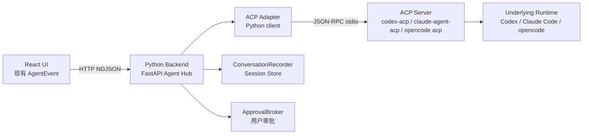
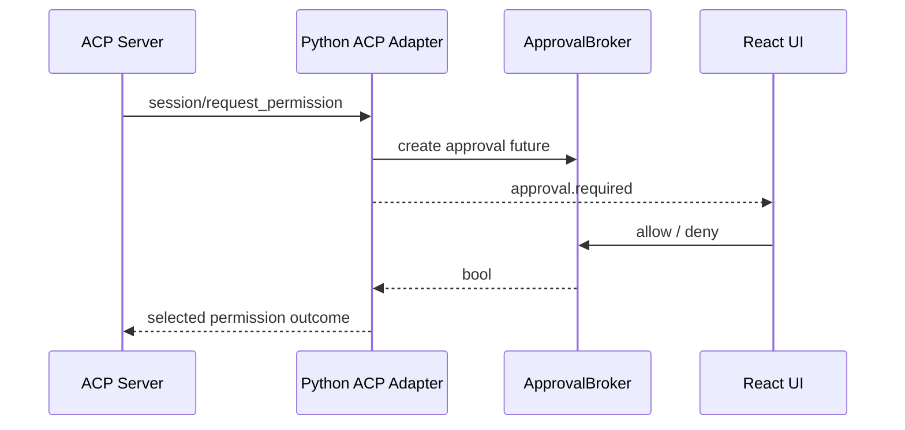

# Python Backend ACP Adapter 设计

验证日期：2026-07-02

本文记录 code-lite 在保留当前 Python backend 与 Tauri sidecar 架构的前提下，实现 ACP adapter 的技术路线。此前曾讨论过把 backend 迁移到 Node/TypeScript，以便贴近 `codex-acp`、`claude-agent-acp`、`opencode acp` 这类 runtime 入口；参考 VibeX 后可以确认，ACP 本质是 JSON-RPC over stdio，不绑定 Node。Rust 可以直接实现 ACP client，Python backend 同样可以。

因此新的判断是：短期不重写 backend 技术栈，而是在当前 Python Agent Hub 中新增 `acp` adapter。

## 1. 结论

新的推荐架构：

```text
React UI
  -> Tauri ensure_backend
  -> Python backend sidecar
  -> FastAPI HTTP / NDJSON
  -> Python ACP Adapter
  -> ACP server process
  -> Codex / Claude Code / opencode runtime
```

关键判断：

1. ACP 是协议，不是 Node 专属 SDK。
2. Python backend 可以作为 ACP client，通过 stdin/stdout 与 ACP server 交换 JSON-RPC 消息。
3. `codex-acp`、`claude-agent-acp`、`opencode acp` 仍然是独立子进程，Python 只负责启动、通信、事件映射和生命周期管理。
4. 当前 UI、Tauri `ensure_backend`、FastAPI route、NDJSON stream、`ApprovalBroker`、`ConversationRecorder` 都可以保留。
5. 产品态是否需要 Node，取决于具体 ACP server 的分发方式，不取决于 backend 是否为 Python。
6. 后续可以继续保留 Native SDK adapter 路线，但 coding agent 主线优先走 ACP。

整体关系：



## 2. VibeX 带来的启发

已将 `Xircth/VibeX` 拉到本地 `ref/VibeX` 作为参考。该目录已通过 `ref/` 加入 `.gitignore`，不会进入本仓库跟踪。

VibeX 的核心做法不是 Node backend，而是：

```text
Tauri / Rust backend
  -> crates/agents
  -> agent-client-protocol Rust crate
  -> spawn ACP server
  -> stdio JSON-RPC ACP
```

可借鉴点：

1. ACP runtime 应有统一 registry，不应把每个 agent 的命令写死在业务逻辑里。
2. 分发方式应支持 `npx`、固定 binary、system path、uvx 等多种来源。
3. ACP connection 应有明确生命周期：spawn、initialize、session/new、prompt、cancel、disconnect。
4. 权限请求应通过产品自己的 approval broker，而不是让 UI 直接理解 ACP 原始结构。
5. stderr ring buffer、handshake timeout、prompt idle timeout 对真实 agent 很重要。
6. Windows 下启动 `npx`、`.cmd`、`.bat` 要特殊处理，否则裸 `npx` 或 npm shim 可能无法被子进程正确启动。

不能直接照搬点：

1. VibeX 的 ACP client 使用 Rust `agent-client-protocol` crate，Python 需要自己实现轻量 JSON-RPC transport，或等后续成熟 Python client。
2. VibeX 前端已经围绕 ACP-native timeline 重构；code-lite 当前 UI 暂不改，仍消费现有 `AgentEvent`。
3. VibeX 是 Tauri command 直连 Rust runtime；code-lite 当前是 UI 到 FastAPI，本地 HTTP/NDJSON 仍保留。

## 3. 当前 code-lite 可保留的部分

当前 Python backend 已经具备实现 ACP adapter 的大部分产品边界：

| 模块 | 当前职责 | ACP 路线处理 |
| --- | --- | --- |
| `src-tauri/` | 启动、停止、监控 backend sidecar | 暂不改变 |
| `backend/pc_agent_backend/api/routes/turns.py` | `/api/turns/stream` NDJSON 输出 | 暂不改变 |
| `AgentAdapter` protocol | `stream_turn()` 与 `cancel_turn()` | 新增 `AcpAgentAdapter` 实现 |
| `ApprovalBroker` | 等待 UI 审批决定 | 复用，用于 ACP permission request |
| `ConversationRecorder` | 根据 `AgentEvent` 更新 session/message | 复用 |
| `ModelSettingsStore` | 当前模型配置 API | 复用，ACP adapter 可把 model 信息作为 config override |
| `NanobotAgentAdapter` | 旧 nanobot 原型 | 保留为兼容 adapter，不再作为主线 |

这意味着第一阶段不需要改 UI，也不需要重写 Tauri sidecar。

## 4. 新增目录设计

建议新增：

```text
backend/pc_agent_backend/agents/acp/
  __init__.py
  adapter.py
  client.py
  transport.py
  mapper.py
  registry.py
  process.py
  approvals.py
```

职责：

| 文件 | 职责 |
| --- | --- |
| `adapter.py` | 实现现有 `AgentAdapter` protocol，向 FastAPI 输出 `AgentEvent` |
| `client.py` | ACP 方法封装：initialize、session/new、session/load、session/prompt、session/cancel |
| `transport.py` | JSON-RPC stdio transport，处理 request/response/notification |
| `mapper.py` | ACP update 到 code-lite `AgentEvent` 的映射 |
| `registry.py` | Codex、Claude Code、opencode 的 command、env、分发方式描述 |
| `process.py` | 子进程启动、Windows `.cmd` 处理、stderr buffer、进程树清理 |
| `approvals.py` | ACP permission options 与 code-lite allow/deny 的映射 |

同时修改：

```text
backend/pc_agent_backend/agents/registry.py
backend/pc_agent_backend/main.py
backend/pc_agent_backend/core/config.py
```

目标是支持：

```powershell
uv run --project backend python -m pc_agent_backend.main --agent-adapter acp
```

以及：

```powershell
$env:REPAIR_AGENT_ADAPTER = "acp"
```

## 5. ACP Runtime Registry

ACP adapter 不应只认识一种命令。建议 registry 描述 runtime 分发方式：

```json
{
  "id": "codex-acp",
  "label": "Codex",
  "distribution": {
    "kind": "npx",
    "package": "@agentclientprotocol/codex-acp",
    "cmd": "codex-acp",
    "args": []
  },
  "defaultMode": "read-only",
  "configMode": "user-native"
}
```

```json
{
  "id": "opencode-acp",
  "label": "opencode",
  "distribution": {
    "kind": "system",
    "cmd": "opencode",
    "args": ["acp"]
  },
  "defaultMode": "ask",
  "configMode": "user-native"
}
```

推荐支持的分发类型：

| 类型 | 示例 | 用途 |
| --- | --- | --- |
| `npx` | `npx -y @agentclientprotocol/codex-acp codex-acp` | 开发期和 npm 分发 runtime |
| `binary` | `%APPDATA%/code-lite/runtimes/.../codex-acp.exe` | 产品托管固定版本 |
| `system` | `opencode acp` | 使用用户 PATH 中已有命令 |
| `custom` | 用户选择绝对路径 | 高级配置和调试 |

发现优先级建议：

1. 用户显式配置的绝对路径。
2. code-lite 托管 runtime 目录中的固定版本。
3. 系统 PATH 中的命令。
4. 开发期可选 `npx -y`。

不要从当前 workspace 的 `node_modules/.bin` 自动发现 agent runtime，除非用户明确选择。否则项目代码可以劫持 agent 可执行入口。

## 6. 是否还需要 Node

保留 Python backend 后，不代表完全不需要 Node。更准确地说：

1. Python backend 不需要 Node 才能实现 ACP client。
2. 某些 ACP server 如果以 npm 包分发，运行它们时仍需要 Node/npm 或一个已安装好的 npm runtime。
3. 如果 ACP server 提供平台二进制，则可以不依赖用户本机 Node。
4. 产品态可以由 code-lite 托管 Node runtime 或托管固定 binary，避免要求用户预装 Node。

因此新的产品安装策略是：

```text
Python backend sidecar
  仍然作为 Tauri sidecar 打包。

ACP runtime
  独立托管在 code-lite runtime 目录。
  可来自 npm package、binary release、system command 或 custom path。
```

建议目录：

```text
开发环境：
  <repo>/data/runtimes/acp/

安装环境：
  %USERPROFILE%/.code-lite/runtimes/acp/
```

每个 runtime 保存 manifest：

```json
{
  "adapterId": "codex-acp",
  "version": "1.0.2",
  "source": "code-lite-managed",
  "command": "C:/Users/.../code-lite/runtimes/acp/codex-acp/bin/codex-acp.cmd",
  "installedAt": "2026-07-02T00:00:00Z"
}
```

manifest 不保存 API key、token、账号密码或私钥。

## 7. Python ACP Client 设计

### 7.1 Transport

ACP stdio transport 可以用 Python 标准库实现：

```text
asyncio.create_subprocess_exec(...)
  stdin=PIPE
  stdout=PIPE
  stderr=PIPE
```

transport 职责：

1. 每个 JSON-RPC 消息写一行 UTF-8 JSON。
2. 从 stdout 按行读取 JSON。
3. 根据 `id` 匹配 request/response。
4. 处理 agent 发来的 request，例如 permission、terminal、fs。
5. 处理 notification，例如 `session/update`。
6. stderr 写入 ring buffer 和 backend log。
7. 子进程退出时取消 pending futures。

Windows 注意：

1. 启动 `npx` 时应解析到 `npx.cmd`。
2. `.cmd` / `.bat` 应通过 `cmd.exe /d /c` 包装。
3. 路径和参数必须分开传递，避免字符串拼接 shell 注入。
4. 取消时要清理进程树，而不只是杀父进程。

### 7.2 Client

`AcpClient` 封装协议方法：

```text
initialize()
new_session(cwd, mcp_servers, additional_directories)
load_session(session_id, cwd)
prompt(session_id, blocks)
cancel(session_id)
set_session_mode(session_id, mode)
set_session_config_option(session_id, key, value)
close()
```

第一阶段需要实现：

1. `initialize`
2. `session/new`
3. `session/prompt`
4. `session/cancel`
5. `session/request_permission`
6. `session/update`

`session/load`、mode、config options 可以第二阶段加入。

### 7.3 Adapter

`AcpAgentAdapter.stream_turn()` 对现有 FastAPI 来说仍然只是一个 async iterator：

```text
AgentRunRequest
  -> ensure runtime connection
  -> ensure ACP session for conversation
  -> send prompt
  -> yield code-lite AgentEvent
```

建议内部状态：

```text
active_connections:
  key = runtime_id + workspace
  value = AcpConnection

conversation_sessions:
  key = conversation_id
  value = acp_session_id

active_turns:
  key = turn_id
  value = cancel handle

pending_permissions:
  key = approval_id
  value = ACP permission responder
```

## 8. 会话生命周期

### 8.1 MVP 方案

为了尽快验证，可以先做“连接按需启动，进程随 backend 生命周期保留”：

```text
第一次 turn
  -> spawn ACP server
  -> initialize
  -> session/new
  -> session/prompt

同一 conversation 后续 turn
  -> 复用 acp_session_id
  -> session/prompt

backend 退出
  -> close ACP child process
```

这样能保留 agent session state，也不会每一轮都重新启动 runtime。

### 8.2 不推荐长期每 turn 新进程

每 turn 都 spawn ACP server 虽然实现简单，但缺点明显：

1. session state 难保留。
2. 启动慢。
3. usage 和 context 不连续。
4. 权限、终端、MCP server 生命周期难管理。

可以作为 smoke test，但不应作为产品默认实现。

### 8.3 session/load 与恢复

如果 runtime 支持 `session/load`，后续可在会话恢复时使用：

```text
conversation_id
  -> stored acp_session_id
  -> session/load
  -> 失败则 session/new
```

如果 runtime 不支持或 session 文件丢失，UI 应显示“runtime 原生会话不可恢复”，但 code-lite 自己的消息历史仍由 `ConversationRecorder` 保存。

## 9. 事件映射

ACP 原始事件不直接给 UI。Python adapter 负责映射到当前 `AgentEvent`。

| ACP update / result | code-lite event |
| --- | --- |
| prompt 开始发送 | `agent.run.started` |
| `agent_message_chunk` | `agent.text.delta` |
| `agent_thought_chunk` | `agent.reasoning.delta` |
| `tool_call` | `agent.tool.started` |
| `tool_call_update` completed | `agent.tool.completed` |
| `tool_call_update` failed | `agent.tool.failed` |
| `plan` | 暂存入 `metadata` 或后续扩展 `agent.plan.updated` |
| `usage_update` | 放入 `agent.run.completed.usage`，后续扩展 `agent.usage.updated` |
| `session/request_permission` | `approval.required` |
| `stopReason=end_turn` | `agent.run.completed` |
| `stopReason=cancelled` | `agent.run.failed` 或后续扩展 `agent.run.cancelled` |
| ACP error | `agent.run.failed` |

当前 UI 支持的事件集合有限。第一阶段不要新增 UI 必须理解的新事件，避免前端联动改造。

### 9.1 流式文本去重

VibeX 中有一个重要细节：部分 ACP server 可能既发送 delta，又在末尾重放完整文本快照。Python mapper 也应做简单去重：

1. 按 `conversation_id + turn_id + channel` 维护累计文本。
2. 如果新 chunk 等于当前完整累计文本，丢弃。
3. 如果新 chunk 以已累计文本为前缀，可只输出增量部分。
4. 非文本 content block 直接透传或转成摘要。

## 10. 权限审批

ACP 的权限请求来自 agent 到 client 的 request：

```text
session/request_permission
```

Python adapter 映射流程：



当前 UI 只有 `allow` / `deny`。ACP 可能提供多个 options，例如：

```text
allow_once
allow_always
reject_once
reject_always
```

建议映射：

| UI 决策 | ACP option 选择 |
| --- | --- |
| allow | 优先 `allow_once`，否则第一个 allow option |
| deny | 优先 `reject_once`，否则第一个 reject option |
| 取消或断流 | reject 或 cancelled |

第一阶段不要默认使用 `allow_always`，除非 UI 之后明确支持“始终允许”。

## 11. Terminal 与 Filesystem Host 能力

ACP client 可以向 agent 声明自己支持 terminal 和 filesystem 能力。MVP 建议保守：

```json
{
  "fs": {
    "readTextFile": true,
    "writeTextFile": false
  },
  "terminal": false
}
```

理由：

1. 当前 code-lite 的强权限边界尚未完整实现。
2. ACP permission request 不等于所有危险动作都能前置拦截。
3. runtime 原生工具可能仍然绕过 client-side fs/terminal gateway。
4. 先做 compat mode，确认事件、审批、usage、session 正常后，再做 gateway mode。

后续 gateway mode 才实现：

1. `fs/read_text_file`
2. `fs/write_text_file` 加 diff 和审批
3. `terminal/create`
4. `terminal/output`
5. `terminal/kill`
6. 路径归一化和 workspace root 检查

## 12. Runtime 配置模式

ACP 不统一各 runtime 的配置文件。Python adapter 需要显式支持两种模式：

| 模式 | 含义 | 用途 |
| --- | --- | --- |
| `user-native` | 使用用户已有 `~/.codex`、`~/.claude`、opencode config | 上手快 |
| `code-lite-isolated` | 设置 code-lite 专用 home/config dir | 可控、可复现 |

建议配置文件：

```text
data/config/acp_runtime_config.json
```

示例：

```json
{
  "defaultRuntime": "codex-acp",
  "runtimes": {
    "codex-acp": {
      "enabled": true,
      "distribution": {
        "kind": "npx",
        "package": "@agentclientprotocol/codex-acp",
        "cmd": "codex-acp",
        "args": []
      },
      "configMode": "user-native",
      "env": {
        "INITIAL_AGENT_MODE": "read-only",
        "NO_BROWSER": "1"
      }
    }
  }
}
```

敏感信息不要写入该文件。API key、token 应只来自用户安全配置、系统环境变量或后续密钥存储。

## 13. Codex / Claude Code / opencode 策略

### 13.1 Codex

开发期：

```powershell
npx -y @agentclientprotocol/codex-acp
```

Python adapter 可设置：

```text
INITIAL_AGENT_MODE=read-only
NO_BROWSER=1
CODEX_HOME=<isolated dir>
CODEX_PATH=<user selected codex path>
```

策略：

1. 默认 read-only。
2. `CODEX_HOME` 只在 isolated 模式设置。
3. user-native 模式沿用用户本机 Codex 登录和配置。
4. 不在 code-lite 仓库写入 API key。

### 13.2 Claude Code

开发期：

```powershell
npx -y @agentclientprotocol/claude-agent-acp
```

策略：

1. 先验证 initialize 和 session/new。
2. 确认 npm 包是否完整带 native Claude Code binary。
3. 验证 `~/.claude`、项目 `.claude`、`CLAUDE.md`、skills 的加载行为。
4. 如果隔离配置能力不明确，先标为 experimental。

### 13.3 opencode

开发期：

```powershell
opencode acp
```

策略：

1. 优先支持 system command。
2. 后续支持托管 opencode binary。
3. isolated 模式可设置 `OPENCODE_CONFIG_DIR` 和 `OPENCODE_CONFIG_CONTENT`。
4. 高风险 workspace 不默认继承项目 `.opencode` 配置，除非用户选择。

## 14. 与当前 Tauri Sidecar 的关系

保留当前 Tauri 关系：

```text
Tauri Desktop
  -> ensure_backend()
  -> Python backend sidecar
  -> 127.0.0.1:8765
```

短期不需要：

1. 把 backend 换成 Node。
2. 改 UI 的 `ensureBackend()`。
3. 改 `/api/turns/stream` 协议。
4. 改 Tauri sidecar 启停模型。

需要的小改动：

1. `main.py` 的 `--agent-adapter` choices 增加 `acp`。
2. `agents/registry.py` 支持 `acp`。
3. `health` 和 `settings/about` 显示当前 adapter 为 `acp`。
4. 打包时确保 ACP runtime 目录和 Python backend sidecar 都能被定位。

长期命名迁移，例如 `PC_AGENT_*` 到 `CODE_LITE_*`，可以单独处理，不和 ACP adapter 第一阶段混在一起。

## 15. 实施阶段

### 阶段 1：Mock ACP 接入 Python backend

目标：

1. 把 `demo/acp-demo/acp_mock_demo.py` 中的协议经验迁入 backend。
2. 新增 `AcpStdioTransport`，先连接 mock ACP server。
3. 实现 initialize、session/new、session/prompt。
4. 映射 text delta、tool、approval、completed。
5. 不调用真实模型。

验证：

```powershell
uv run --project backend python -m pc_agent_backend.main --agent-adapter acp
```

配合 mock server 跑一轮 `/api/turns/stream`。

### 阶段 2：Codex ACP smoke

目标：

1. 连接 `codex-acp`。
2. 默认只做 initialize 和 session/new。
3. 记录 agentCapabilities、modes、configOptions。
4. 不默认发送真实 prompt。

验证：

```powershell
python .\demo\acp-demo\codex_acp_smoke.py
python .\demo\acp-demo\codex_acp_smoke.py --session-new
```

然后把同等逻辑迁入 adapter。

### 阶段 3：受控真实 turn

目标：

1. 用户显式选择 Codex ACP。
2. 默认 `read-only`。
3. 支持真实 prompt。
4. 映射文本、reasoning、tool、usage 和 stopReason。
5. cancel 能发送 `session/cancel`。

验证：

1. 浏览器 fallback UI 连接 Python backend。
2. 发送只读问题。
3. 确认会话历史可保存。
4. 确认中断不会留下 hanging turn。

### 阶段 4：审批接入

目标：

1. ACP permission request 映射到 `approval.required`。
2. UI allow/deny 回传到 ACP selected outcome。
3. pending approval 在 turn cancel、stream disconnect、process exit 时自动 reject。

验证：

1. mock ACP server 主动请求 permission。
2. allow path 和 deny path 都通过。
3. 用户取消 turn 时 pending permission 不泄漏。

### 阶段 5：Claude Code 与 opencode

目标：

1. 同一个 `AcpAgentAdapter` 支持 runtime id 切换。
2. Claude、opencode 差异只在 registry、env、capability caveat。
3. 分别验证 initialize、session/new、最小只读 prompt。

### 阶段 6：Runtime 托管与打包

目标：

1. 设计 `data/runtimes/acp` 或 `%USERPROFILE%/.code-lite/runtimes/acp`。
2. 固定 runtime 版本。
3. 提供安装/检测/preflight。
4. 产品态不要求用户手动安装 Node、npm、Codex、Claude Code 或 opencode。

## 16. 测试策略

### 16.1 单元测试

1. JSON-RPC request/response 匹配。
2. notification 分发。
3. agent-to-client request 分发。
4. permission option allow/deny 映射。
5. text chunk 去重。
6. Windows command resolution。

### 16.2 集成测试

1. mock ACP server 完整 turn。
2. mock permission allow。
3. mock permission deny。
4. cancel turn。
5. 子进程异常退出。
6. stderr buffer 出现在错误信息中。

### 16.3 真实 runtime smoke

真实 runtime smoke 默认不发送 prompt：

1. `codex-acp` initialize。
2. `codex-acp` session/new。
3. `claude-agent-acp` initialize。
4. `opencode acp` initialize。

真实 prompt 必须由开发者显式开启，避免无意消耗模型额度或触发工具动作。

## 17. 风险与缓解

| 风险 | 说明 | 缓解 |
| --- | --- | --- |
| 自研 Python ACP client 协议漂移 | ACP schema 更新后字段变化 | transport 保持薄层，mapper 保留 raw diagnostic，增加 smoke |
| npm runtime 仍需要 Node | backend 是 Python 也无法消除 npm 包运行依赖 | 产品托管 Node runtime 或优先 binary 分发 |
| 权限不是硬安全边界 | runtime 原生工具可能绕过 client permission | MVP 标注 compat mode，后续做 gateway mode |
| Windows 子进程启动失败 | `npx.cmd`、`.bat`、PATH/PATHEXT 特殊 | `process.py` 专门处理 Windows command resolution |
| 进程树清理不完整 | ACP server 还会启动底层 runtime | backend cancel + Tauri taskkill 双层兜底 |
| usage 数据不稳定 | 不同 ACP server 发送频率不同 | best effort 展示和落 raw event |
| session 恢复失败 | runtime session 文件可能丢失 | code-lite 历史仍可读，ACP session load 失败时新建 session |
| 文本重复 | 一些 server 同时发 delta 和完整快照 | mapper 做 chunk 去重 |

## 18. 推荐下一步

下一步建议只做最小代码验证：

1. 新增 `backend/pc_agent_backend/agents/acp/transport.py`。
2. 用 mock ACP server 跑通 JSON-RPC stdio。
3. 新增 `AcpAgentAdapter`，先只返回 mock text delta。
4. 接入现有 `/api/turns/stream`。
5. 再把 `codex_acp_smoke.py` 的 initialize/session-new 逻辑迁入 adapter。

这条路径最大程度保留现有架构，同时把 code-lite 的 coding agent 主线转向 ACP。
