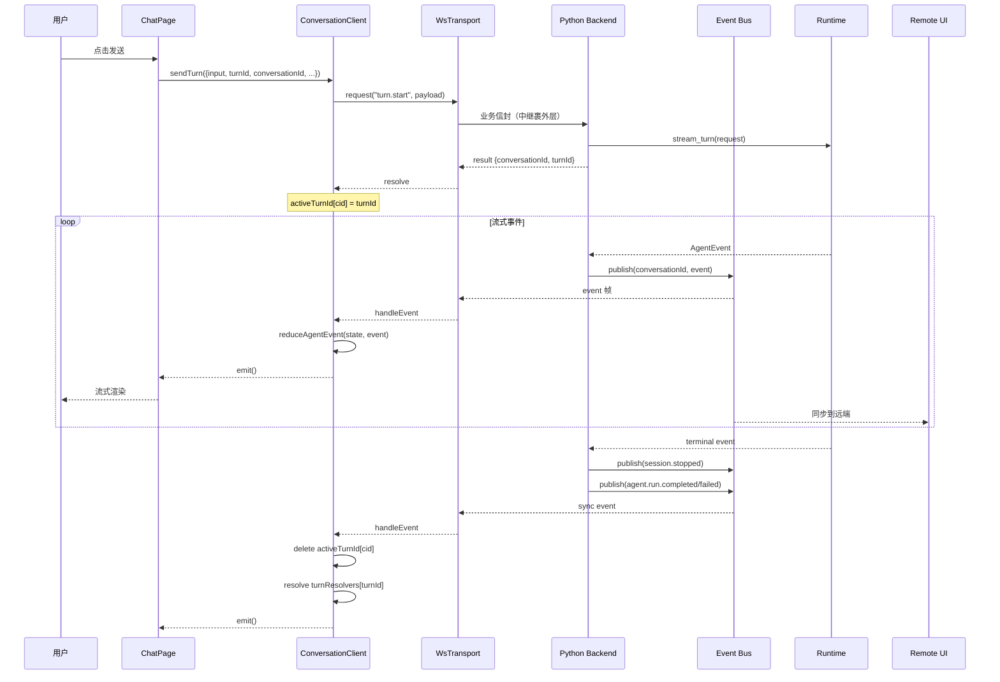
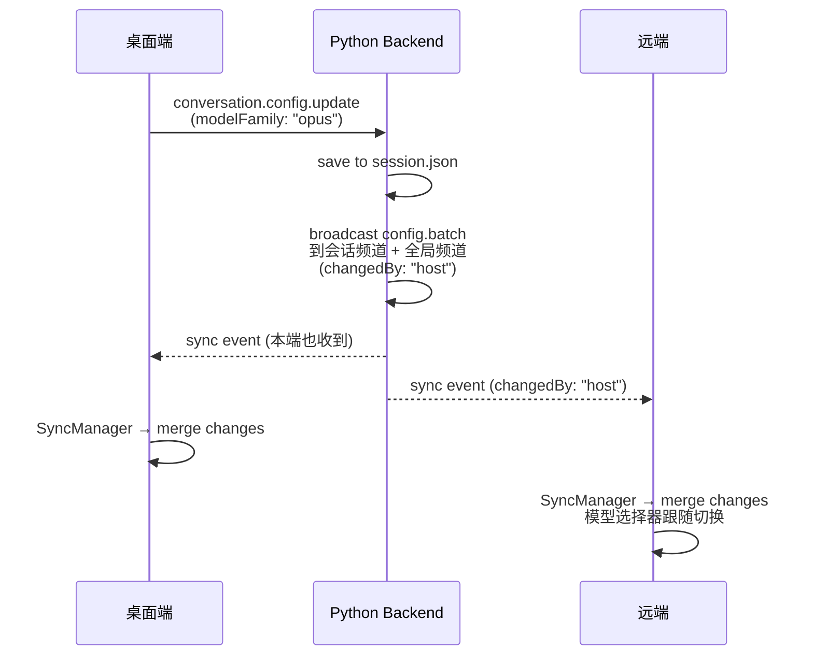

# code-lite 架构设计

> 更新于 2026-07-10：双端统一同步协议大重构完成

## 1. 架构目标

code-lite 是一个**桌面优先、双端统一**的多 Agent 工作台。通过 ACP（Agent Client Protocol）接入 Codex、Claude Code、opencode、nanobot 等 runtime，并提供一致的会话体验。

核心目标：

1. **双端同源**：桌面前端（ui）和远端（ui-remote）跑**同一套同步协议 + 同一套状态逻辑**，proxy 对上层完全透明
2. **Agent 隔离**：通过 `AcpAgentAdapter` + runtime descriptor，不把业务层绑定到任何一个 SDK/CLI
3. **统一事件流**：消息、工具、命令、文件、审批、错误、token 用量全部通过 `AgentEvent` 协议承载
4. **双向同步**：运行态（谁在运行）、配置（模型/思考/权限）、终止会话，双端均可操作
5. **安全诚实**：对 runtime 原生安全能力保持诚实描述，不把无法前置拦截的行为包装成强审批能力

## 2. 总体架构

### 2.1 进程模型

```text
┌────────────────────────────────────────────────────────────────────┐
│                         Tauri Desktop                              │
│  ┌────────────┐    ┌────────────────┐    ┌──────────────────────┐ │
│  │ WebView UI │◄──►│ Python Backend │◄──►│   Agent Runtimes     │ │
│  │  (React)   │WS  │   (sidecar)    │ACP │ codex-acp            │ │
│  │            │    │                │    │ claude-agent-acp     │ │
│  └────────────┘    └────────────────┘    │ opencode acp         │ │
│        │                 │                └──────────────────────┘ │
│        │                 │                                          │
│        │                 ▼                                          │
│        │          ┌────────────┐                                   │
│        │          │ Event Bus  │ ← 所有事件流的枢纽                 │
│        │          └─────┬──────┘                                   │
│        │                │                                          │
│        │                ▼                                          │
│        │          ┌────────────┐                                   │
│        │          │RemoteBridge│ ← host 主动 dial out（NAT 穿透）   │
│        │          └─────┬──────┘                                   │
└────────┼────────────────┼───────────────────────────────────────────┘
         │                │ WebSocket
         │                ▼
         │     ┌─────────────────────┐
         │     │  Proxy Server       │ ← 中继服务器（可部署在公网）
         │     │  (relay endpoint)   │
         │     └─────────┬───────────┘
         │               │ WebSocket
         │               ▼
         │     ┌─────────────────────┐
         │     │   ui-remote (Web)   │ ← 任意设备的远端工作台
         │     │   (React + Relay)   │
         │     └─────────────────────┘
         │
         ▼
     用户操作
```

### 2.2 双端统一传输

桌面端（ui）和远端（ui-remote）通过**同一个 `WsTransport` 基类**连接后端，业务信封字节级一致：

```text
┌──────────────────────────────────────────────────────────────────┐
│                     WsTransport 基类                              │
│   统一：connect/request/subscribe/unsubscribe                    │
│        onEvent/onSnapshot/onStatus/onControl                     │
│        pending RPC、requestId、60ms delta flush                  │
└────────────┬──────────────────────────────┬──────────────────────┘
             │                              │
             ▼                              ▼
   ┌─────────────────────┐      ┌──────────────────────────┐
   │   LocalWsTransport  │      │   RelayWsTransport       │
   │                     │      │                          │
   │  直通：业务信封即帧  │      │  裹/拆 {type:"msg"} 外层  │
   │  无握手             │      │  hello/ready 握手         │
   │  urlProvider:       │      │  心跳（20s ping/pong）    │
   │   ensureBackend()   │      │  host.online/offline 控制 │
   │                     │      │  relayUrl/roomId/peerId   │
   └─────────────────────┘      └──────────────────────────┘
             │                              │
             ▼                              ▼
     直连 /api/ws                   经 proxy_server 中转
  (Tauri → Python backend)      (remote → relay → host)
```

**关键约束**：
- 业务信封 `{v, kind, method, requestId, payload}` 两端字节级一致
- 中继外层 `{type:"msg", to/from, payload}` 是传输私有细节，业务层无感
- `SyncManager` / `ConversationClient` / UI 代码不区分直连或中继

### 2.3 统一状态层

```text
┌─────────────────────────────────────────────────────────────────────┐
│                        ConversationClient                            │
│                                                                     │
│  职责：会话列表 + 每会话视图态（消息/运行态/审批/输入/上下文）           │
│                                                                     │
│  核心：reduceAgentEvent（来自 chat-core/sessionReducer）              │
│        + 60ms delta 批处理（双端共享）                                │
│        + SyncManager 驱动运行态/配置                                  │
│        + turnResolvers 内化（sendTurn Promise 收尾）                  │
│                                                                     │
│  暴露：subscribe / getSnapshot / onRawEvent                          │
│        patchSession / replaceSession                                 │
│        sendTurn / cancelTurn / updateConfig                          │
│        openConversation / closeConversation                          │
│        createConversation / archive / delete                         │
│        resolveApproval / resolveInput                                │
│                                                                     │
│  框架无关（无 React 依赖），通过 useSyncExternalStore 接入前端         │
└──────────────────────────────┬──────────────────────────────────────┘
                               │
            ┌──────────────────┼──────────────────────┐
            ▼                  ▼                      ▼
    ┌───────────────┐  ┌────────────────┐   ┌──────────────────┐
    │ SyncManager   │  │ Transport      │   │ AgentEvent       │
    │               │  │ (WsTransport)  │   │ (reduceAgentEvent)│
    │ - session.    │  │                │   │                  │
    │   running     │  │ - connect      │   │ - messages       │
    │ - session.    │  │ - request      │   │ - running        │
    │   stopped     │  │ - subscribe    │   │ - approval       │
    │ - config.*    │  │ - onEvent      │   │ - input          │
    │ - presence.*  │  │                │   │ - context        │
    └───────────────┘  └────────────────┘   └──────────────────┘
```

### 2.4 事件流全景

```text
Runtime (codex/claude/opencode)
    │ ACP stdio
    ▼
AcpAgentAdapter ───► AgentEvent ───► SessionEventBus ─┬─► Local UI (ChatPage)
                                   │                   │
                                   │                   └─► Remote UI (ui-remote)
                                   │
                                   ▼
                            ConversationRecorder (session.json)
                                   │
                                   ▼
                            ConversationStore (磁盘持久化)

                                   │
                                   ▼
                            RemoteBridge ──► Proxy Server ──► ui-remote
```

### 2.5 双端同步协议

运行态和配置通过 `@code-lite/sync` 的 `SyncManager` 统一驱动，嵌入现有 `AgentEvent` 通道：

```text
后端广播（sync 协议事件嵌入 AgentEvent）:
┌─────────────────────────────────────────────────────┐
│ { type: "sync",                                     │
│   syncType: "session.running" | "session.stopped"   │
│            | "config.batch"                         │
│            | "presence.join" | "presence.leave"     │
│            | "control.cancel"                       │
│   syncPayload: { conversationId, turnId, ... }      │
│ }                                                   │
└─────────────────────────────────────────────────────┘
             │
             ▼ 经现有 event pump 传输（本地直发 / 中继透传）
             │
             ▼
前端：SyncManager.feedEvent(event) → 分发到 onSessionRunning/onConfigChange/...
```

**设计要点**：
- **不新增信封类型**，复用现有 `event` 分发通道，中继零改动
- **运行态**同时广播到会话频道 + 全局频道 `*`（列表页显示）
- **后端 session.json 是权威真相源**，前端启动时拉一次 `conversation.list`，后续增量更新
- **双向终止**：任一端 `client.cancelTurn(id)`，后端终止后广播 `session.stopped`
- **来源标记**：远端发起的操作注入 `_startedBy: "remote"` / `_changedBy: "remote"`

## 3. 分层职责

### 3.1 桌面 UI 层（ui/）

```text
ui/
├── pages/
│   └── ChatPage.tsx        页面级编排（draft session、config 选择器、图片附件）
│                            状态由 ConversationClient 驱动，~1300 行（原 2141）
├── features/
│   └── chat/               对话相关组件
│       ├── ChatWorkspace   主工作区（消息流 + 输入框）
│       ├── ChatComposer    输入框（文本 + 图片 + 审批卡片）
│       ├── MessageList     消息流渲染
│       ├── ToolCallViews   工具调用展示（Bash/Edit/Read 等）
│       ├── ApprovalCard    审批卡片
│       └── ConversationHeader 会话头部（标题、模型选择器、思考强度）
├── layout/                 桌面壳稳定布局（Sidebar、AppTitlebar）
├── lib/                    纯函数（chatState、formatters）
└── services/               后端通信适配
    ├── agentClient.ts      getConversationClient 单例、ensureBackend
    ├── localTransport.ts   LocalWsTransport（直通 WsTransport 子类）
    ├── useConversations.ts useSyncExternalStore hook
    └── conversationStore.ts 会话 API（现在全走 WS）
```

**桌面特有逻辑**（保留在 UI 层，不进共享 client）：
- Draft session（`DRAFT_SESSION_ID`）和 draft→real 迁移
- Per-session capabilities 加载/缓存/fallback
- Fast mode（codex 速率 1x/1.5x）
- Codex 模型 id 括号归一化（`family[effort]`）
- Agent 选择面板
- 图片附件上传（HTTP multipart）

### 3.2 远端 UI 层（ui-remote/）

```text
ui-remote/
├── App.tsx                 远端工作台（配置选择器 + 审批卡片 + 终止按钮）
└── services/
    ├── RelayTransport.ts   RelayWsTransport（中继 WsTransport 子类）
    └── useConversations.ts useSyncExternalStore hook
```

远端与桌面**完全同源**，共享 `ConversationClient` + `SyncManager` + `WsTransport`。

### 3.3 Tauri / Rust 层（src-tauri/）

桌面壳，负责：
- 启动/监控 Python backend sidecar
- 窗口、托盘、系统通知、文件选择
- 提供 UI 所需的 Tauri command（`ensure_backend` 等）
- 注入安装态版本、资源路径、运行时环境变量

### 3.4 Python Backend（backend/）

```text
backend/code_lite_backend/
├── main.py / app.py        FastAPI 应用入口
├── api/
│   ├── router.py
│   ├── dependencies.py     get_services 依赖注入
│   └── routes/
│       ├── ws.py           /api/ws WebSocket 端点（所有 RPC handler）
│       ├── turns.py        turn 生命周期 + 串行互锁
│       ├── conversations.py 会话 CRUD
│       ├── sessions.py     session.initialize（capabilities）
│       ├── approvals.py    审批 API
│       └── settings.py     运行时配置 API
├── agents/
│   ├── acp/                通用 ACP adapter（主线）
│   │   ├── adapter.py      AcpAgentAdapter（stream_turn / cancel_turn）
│   │   ├── client.py       ACP stdio client
│   │   └── approvals.py    审批适配
│   ├── runtimes/           runtime descriptor 注册
│   ├── codex/              Codex descriptor
│   ├── claude_code/        Claude Code descriptor
│   └── nanobot/            legacy 兼容
├── core/                   配置、编码、路径工具
├── schemas/                Pydantic 模型
├── services/
│   ├── event_bus.py        SessionEventBus（进程内 pub/sub）
│   ├── conversation_recorder.py  活动态会话状态管理（turn 执行时更新）
│   ├── remote_bridge.py    主动 dial out 到 relay + peer 多路复用
│   └── sync_protocol.py    同步事件构造 + 广播辅助
└── storage/
    └── conversations.py    ConversationStore（session.json / messages.json）
```

**关键职责**：
1. 暴露 `/api/ws` WebSocket 端点（所有 RPC handler 共用）
2. 通过 `SessionEventBus` 发布事件（会话频道 + 全局频道）
3. 把 runtime 私有事件映射为统一 `AgentEvent`
4. `RemoteBridge` 主动 dial out 到 relay（NAT 穿透），多 peer 多路复用
5. `sync_protocol` 广播运行态/配置同步事件

### 3.5 Agent Adapter 层

```text
AgentAdapter
  - describe() -> AgentAdapterDescriptor
  - prepare(runtime_config, workspace) -> AdapterStatus
  - stream_turn(request) -> AsyncIterator[AgentEvent]
  - cancel(turn_id) -> CancelResult
  - list_models() -> ModelListResult
```

当前 adapter 策略：

| Adapter | 状态 | 说明 |
|---------|------|------|
| `acp` | 主线 | 通用 ACP adapter，使用 Python SDK 作为 ACP client |
| `codex` | 稳定 | Codex runtime，通过 `codex-acp` |
| `claude_code` | 稳定 | Claude Code runtime，通过 `claude-agent-acp` |
| `opencode` | 规划 | opencode runtime |
| `nanobot` | legacy | 仅保留早期原型兼容 |

新 coding agent 优先新增 `RuntimeDescriptor` + mapper，不新增完整 adapter。

### 3.6 共享协议包（packages/）

```text
packages/
├── protocol/               AgentEvent 类型 + 线协议定义
│   ├── domain.ts           AgentEvent union、Session、ChatMessage
│   └── wire.ts             WireEnvelope、WireMethod、WireControlType
├── transport/              WebSocket 传输抽象
│   ├── transport.ts        Transport 接口、TransportError
│   └── ws-transport.ts     WsTransport 基类（双端共享）
├── sync/                   双端统一同步协议
│   ├── types.ts            同步消息类型（session/config/control/presence）
│   ├── manager.ts          SyncManager 核心类
│   ├── state-tracker.ts    运行态追踪器
│   ├── config-syncer.ts    配置同步器
│   └── constants.ts        SyncEvents 常量 + 工具函数
└── chat-core/              纯 reducer（无 React 依赖）
    ├── sessionReducer.ts   reduceAgentEvent（单会话视图态）
    ├── conversationClient.ts  ConversationClient 共享状态层
    ├── conversationList.ts 会话列表 reducer
    ├── messageReducer.ts   消息更新工具（updateMessage / upsertToolCall）
    ├── modelGrouping.ts    模型族/思考强度分组
    └── planSnapshots.ts    plan 快照工具
```

## 4. 数据流详解

### 4.1 发起一个 turn



### 4.2 运行态双端同步

```mermaid
sequenceDiagram
    participant Local as 桌面端
    participant B as Python Backend
    participant Remote as 远端

    Note over Local,B,Remote: 桌面端发起 turn
    Local->>B: turn.start
    B->>B: broadcast session.running<br/>到会话频道 + 全局频道
    B-->>Local: sync event (startedBy: "host")
    B-->>Remote: sync event (startedBy: "host")
    Local->>Local: SyncManager → running=true
    Remote->>Remote: SyncManager → running=true<br/>列表显示"运行中"

    Note over Local,B,Remote: 远端点"终止"
    Remote->>B: turn.cancel<br/>(_startedBy: "remote")
    B->>R: cancel_turn
    B->>B: broadcast session.stopped<br/>到会话频道 + 全局频道
    B-->>Local: sync event (stoppedBy: "remote")
    B-->>Remote: sync event (stoppedBy: "remote")
    Local->>Local: SyncManager → running=false
    Remote->>Remote: SyncManager → running=false<br/>列表恢复"空闲"
```

### 4.3 配置双端同步



## 5. 权限与审批模型

### 5.1 权限模式

| 模式 | 含义 |
|------|------|
| `read-only` | 只读观察和分析，尽量不写文件 |
| `workspace_write` | 允许在当前 workspace 内修改文件 |
| `approval_required` | 高风险动作需要用户确认 |
| `full_access` | 用户显式授权的高权限模式，仍需要记录审计 |

### 5.2 双端权限

远端设备接入时根据配置分配角色：

| 角色 | 能力 |
|------|------|
| `viewer` | 只读观看会话事件 |
| `operator` | 可发消息、取消任务、处理审批 |
| `owner` | 主设备用户，拥有撤销连接和授权能力 |

权限校验在 `remote_bridge.py` 的 `_handle_rpc` 中统一执行，本地直连不经过此层。

## 6. 数据存储

### 6.1 后端会话存储

```text
data/
  record/                    # 会话目录
    <conversation_id>/
      session.json           # 会话元数据（含 config / status / archived）
      messages.json          # 消息流
      native-session.json    # native ACP session 绑定
  config/
    app_config.json          # 全局配置
    agent_runtimes.json      # runtime 注册
    remote_bridge.json       # 远端中继配置（pair_key / relay_url）
  runtimes/
    acp/                     # ACP runtime 二进制
  events/                    # 事件日志
  logs/                      # 运行日志
```

`session.json` 是运行态的权威真相源（含 `status: "running" | "idle" | "error"`），前端启动时拉取。

### 6.2 前端状态

前端**不持久化**会话数据到 localStorage——全部从后端 `conversation.list` + 会话频道 snapshot 获取。桌面端保留少量纯 UI 态（draft、图片附件、搜索框文本），但这些不进共享 client。

## 7. 通信协议

### 7.1 本地 / 远端统一 WS

桌面端和远端通过同一个 `/api/ws` WebSocket 端点通信，业务信封格式：

```json
{
  "v": 1,
  "kind": "req | result | error | event | snapshot | control",
  "requestId": "c-xxx | r-xxx",
  "method": "turn.start | subscribe | conversation.list | ...",
  "channel": "<conversation_id> | *",
  "payload": { ... }
}
```

- 桌面端直连：业务信封即帧
- 远端经中继：外层 `{type: "msg", payload: <业务信封>}`，路由字段 `to/from` 由 relay 填充

### 7.2 Backend 与 runtime

通过 ACP stdio：

| Runtime | 连接方式 | 说明 |
|---------|----------|------|
| Codex | `codex-acp` + ACP stdio | 稳定 |
| Claude Code | `claude-agent-acp` + ACP stdio | 稳定 |
| opencode | `opencode acp` + ACP stdio | 规划接入 |
| nanobot | Python SDK | legacy 兼容 |

### 7.3 远端中继

```text
Host (RemoteBridge) ──dial out──► Proxy Server ◄──dial out── Remote (ui-remote)
                                  │
                                  ▼
                            Room Registry
                            (roomId = SHA256(pairKey))
```

- Host 主动 dial out（NAT 穿透），一条连接服务多个 remote
- 中继不解析业务 payload，只按 `roomId` 路由
- 心跳 20s ping/pong，超时 60s 驱逐
- 支持 host.online/offline 状态通知

## 8. 设计原则总结

| 原则 | 体现 |
|------|------|
| **双端同源** | 桌面/远端共享 `ConversationClient` + `WsTransport` 基类 |
| **传输透明** | proxy 外层包装收敛为传输私有细节 |
| **状态单源** | 后端 session.json 是权威真相，前端不持久化会话数据 |
| **增量同步** | sync 事件嵌入 AgentEvent，复用现有 event pump |
| **纯函数 reducer** | chat-core 的 `reduceAgentEvent` 无 React 依赖，双端共用 |
| **运行时隔离** | AgentAdapter 屏蔽 runtime 差异 |
| **安全诚实** | 不承诺超出 runtime 可拦截范围的安全语义 |
